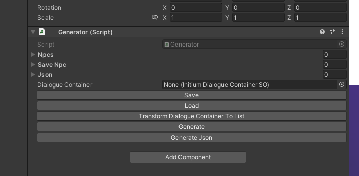
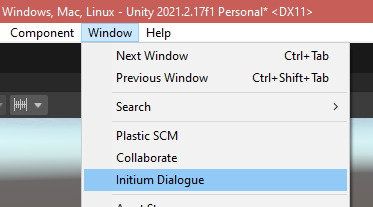
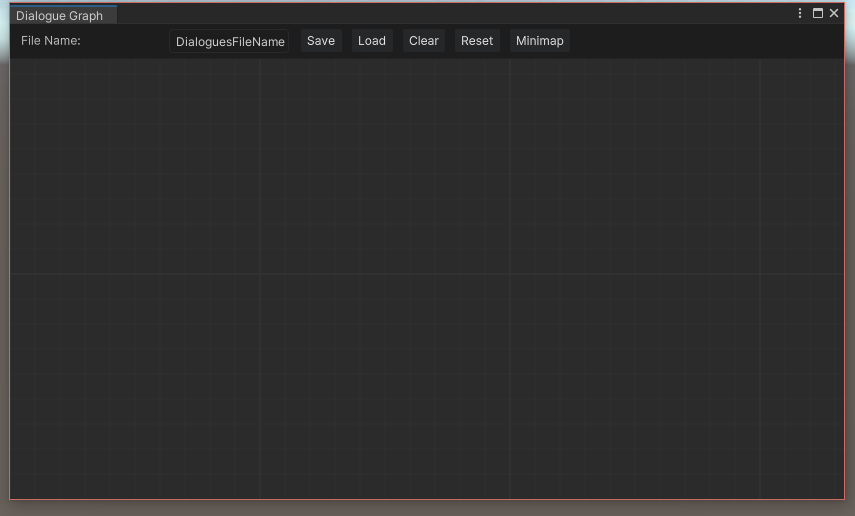
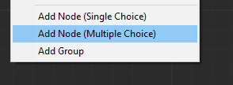
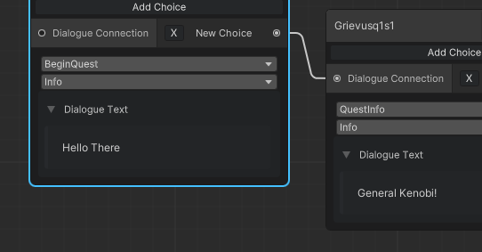

My favorite way to make quests in Minecraft

**Every questline is split into conversations and every conversation contains different dialogue lines with a speaker, a message and the next dialogue line(s).**

I find it is way easier to use a GUI rather then a pencil and paper (or paint) and coding every single quest.

Even with the most efficient way of writing a quest, there is always a better way to do it with a GUI.

This also makes it easier for people without a programming background to make quests.

How to use:

1.  Add the generator component to the any gameobject

****

**The Npcs list:** Shows a summary of the npcs and their dialogue in a raw data way.

**Json list:** Shows a summary of the json raw data that will be saved based on the npcs list.

**Dialogue Container:** The saved node based resource that store all the quests data.

**Save**: Saves the Npcs list into save npc list.

**Load:** Loads the save npc list into normal npc list

**Transform Dialogue Contrainer To List:** Prepares the saved resource to a list to generate into mcfunctions.

**Generate:** Transforms the npcs list to mcfunctions.

**Generate Json:** Generate the extra json used by Minecraft to map the quests to each character.

1.  **Open the Initium Dialogue Window**

**  
**

****

**This was made using UiElements from Unity.**

1.  **Name the quest line and save it (IT DOESN’T HAVE AUTOSAVE YET)**
2.  **Right click to add a new dialogue line**

****

**Single/Multiple Choice: Adds a new Dialogue Line**

**Group: Adds a new Conversation.**

**Every questline is split into conversations and every conversation contains different dialogue lines with a speaker, a message and the next dialogue line(s).**

1.  **After you have made a few questlines, you should group them into conversations**

****

**Just Select the nodes, right click and press add group**
